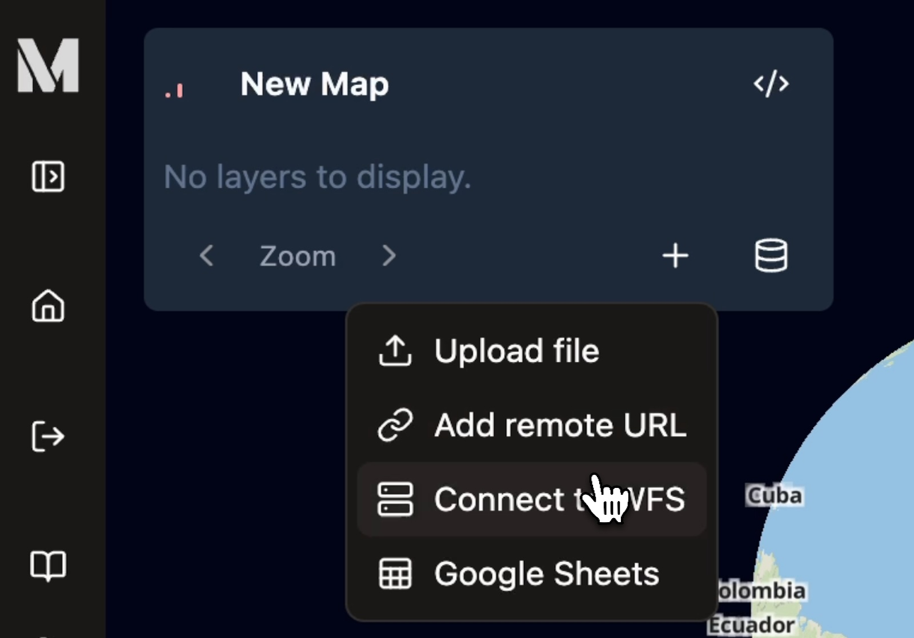
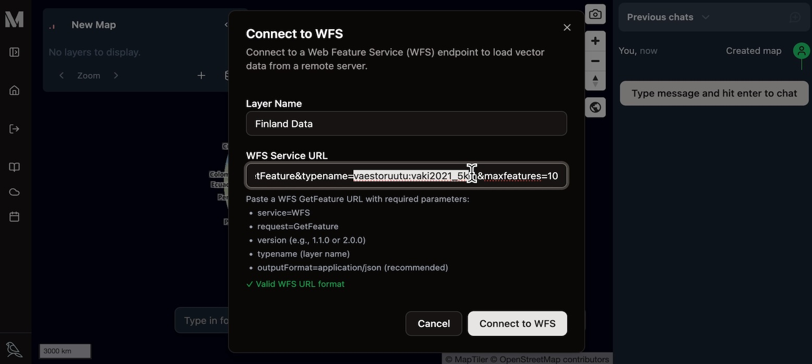
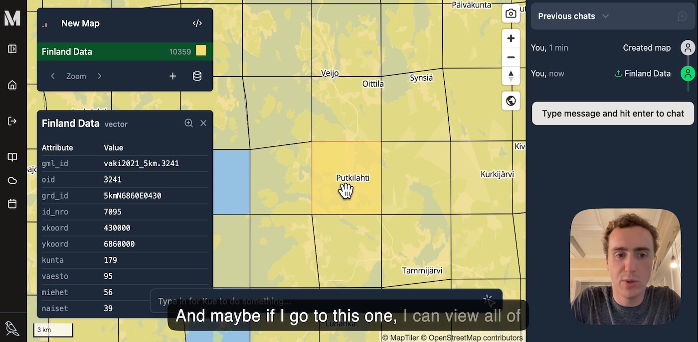

[Web Feature Services (WFS)](https://www.ogc.org/standards/wfs/) are a standard way to share and access vector
geospatial data over the internet. Mundi supports WFS sources, meaning layers in Mundi
can continuously update to an external WFS server.

<iframe width="560" height="316" style="height: 316px; margin-left: auto; margin-right: auto;" src="https://www.youtube.com/embed/pC5HShsI7B8?si=hjmpXxf96U7FiRn-" title="YouTube video player" frameborder="0" allow="accelerometer; autoplay; clipboard-write; encrypted-media; gyroscope; picture-in-picture; web-share" referrerpolicy="strict-origin-when-cross-origin" allowfullscreen></iframe>

This guide demonstrates how to connect to a WFS server using Mundi, using a
[public GeoServer instance from Statistics Finland](https://stat.fi/en) as an example.

## Add layer from remote WFS source

Once you have [opened a Mundi map](/getting-started/making-your-first-map/), in the bottom of the
layer list, click the **Add layer source** (**+**) icon.
Then, from the dropdown, click **Connect to WFS**.

### Configure the WFS Connection

The **Connect to WFS** dialog requires a name for your layer and a specific
URL to fetch the data.

1.  **Layer Name**: Enter a descriptive name for the layer, this will appear
    in the layer list. For this example, we'll use `Finland Data`.
2.  **WFS Service URL**: Paste the full WFS `GetFeature` request URL into this
    field. This URL tells the remote server exactly which dataset you want to
    access.

#### Understanding the WFS `GetFeature` URL

In this demo, we're using `https://geo.stat.fi/geoserver/wfs?service=WFS&version=2.0.0&request=GetFeature&typename=vaestoruutu:vaki2021_5km&maxfeatures=10` as our WFS URL.

This is slightly different from most WFS configurations, because most implementations
of WFS ask for the `GetCapabilities` URL or merely the `/wfs` endpoint. Here,
you need to specify precisely which layer you want to fetch using `GetFeature`.

So in this case, we're providing `typename=vaestoruutu:vaki2021_5km` to get a particular
layer from GeoServer. You can ignore `maxfeatures`.

Once the correct URL is in place, click the **Connect to WFS** button. Mundi
will fetch the data, create tiles for fast rendering, and automatically
set up polling to keep the data synchronized with the source.

## Exploring the Loaded WFS Data

After a successful connection, the layer will be added to your map and the
data will be displayed.

In our example, a grid of data for Finland appears. The **Map Layers**
panel confirms the layer has been added, showing a total of `10,359` features and
noting the data's original Coordinate Reference System (CRS) is `EPSG:3067`.

You can interact with this data just like any other vector layer in Mundi.
Zoom in to see the individual grid cells, and click on any feature to open a
popup displaying its attributes.

