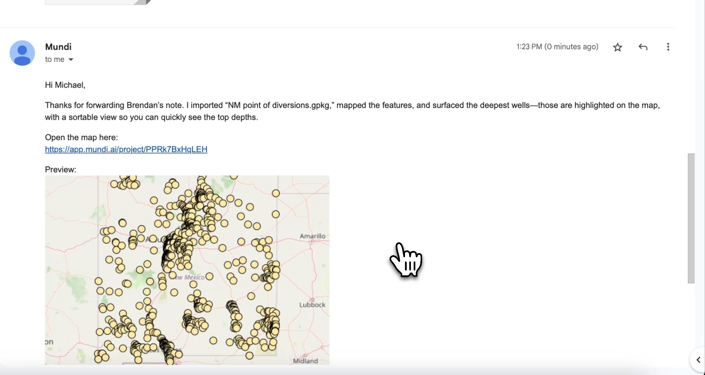
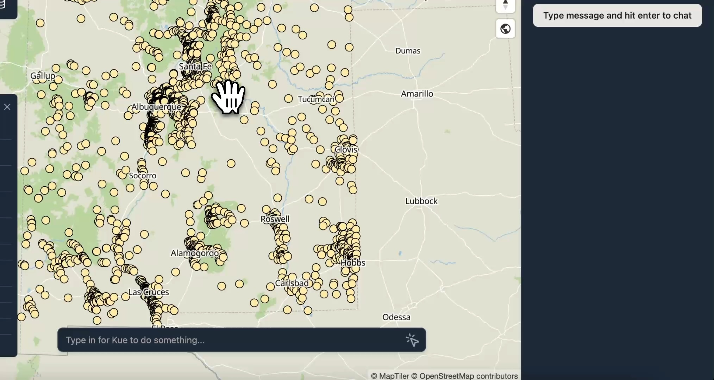

You can send or forward any email with spatial data to `map@mundi.ai` and Kue
will [make a web map](/getting-started/making-your-first-map/)
and reply to you with a shareable web link. For example, if
your coworker emails you a `.gpkg` and a GeoTIFF, you can forward that email to
`map@mundi.ai` and you'll get back an image preview of the data, styled by
[our AI GIS agent](https://mundi.ai/), and a link that you can send to your
team. This map will be placed in your Mundi account as if you created it.

This is a simpler alternative to downloading files, opening a desktop GIS,
importing layers and rendering as PDF just to quickly share a visualization.

## How it works

Whenever you receive an email containing spatial data or have local files you
want to quickly map, you can send them to `map@mundi.ai`. The AI agent can
see both the title and body of your email text, and will style your uploaded
data according to your requests. For example, you might ask for a categorical styling
on a particular attribute. The AI agent writes the email response as well, so it
can respond to pointed questions about features, answered via SQL. For example:

> What's the deepest well in this geopackage?

This works both on new emails *and* forwarded emails. Be sure to include the attachments
if you're forwarding a previous email with attachments.

## Example of forwarding an email

In this example, a colleague has sent a GeoPackage (`.gpkg`) file containing
well locations in New Mexico and has asked to identify the deepest ones.

Instead of downloading the file and opening it in QGIS or ArcGIS Pro, we can
simply forward the email directly to Mundi's AI agent.

1.  In your email client, select the option to **Forward** the message and set **To** to `map@mundi.ai`.
2.  Click **Send**. The original email's body and attachments will be sent to
    [Mundi.ai](https://app.mundi.ai/) for processing.

### AI agent responds with a map

After about a minute, Kue will reply in the same email thread. This reply includes a
brief summary of the actions taken, a static map preview for quick reference, and
most importantly, a link to the fully interactive web map.

In this case, Kue not only mapped the data but also interpreted the original
request ("see what the deepest wells are here") and automatically highlighted
the deepest wells on the map.

### Open or share the web map

Clicking the link in the reply email opens the newly created project directly
in the Mundi web application. The spatial data from the `.gpkg` file is now a
layer on an interactive map.

This project is saved to your account, and the link is permanently shareable.
You can forward the reply email or send the link directly to your colleague so
they can view and interact with the data themselves.

## Technical details

### Supported formats

Kue can receive via email
[any vector or raster format that you can upload normally to Mundi](/getting-started/uploading-files/),
including:

-   GeoPackage (`.gpkg`)
-   Shapefile (`.zip` containing all necessary files)
-   GeoJSON (`.geojson` or `.json`)
-   KML/KMZ (`.kml` or `.kmz`)
-   GeoTIFF (`.tif` or `.tiff`)

### Deployment options

This feature is available in [on-prem Mundi](/deployments/on-premise-vpc-kubernetes-deployment/)
and does not require any third
party infrastructure. This means you can keep sensitive data within your own network
infrastructure and adhere to third-party sending restrictions from your IT team.

### Troubleshooting responses

If you are emailing the correct email address and not receiving a response within ten
minutes, please check the following:

- You must have a [Mundi cloud account](https://app.mundi.ai)
- Your email address must have correctly configured SPF / DKIM / DMARC
- Attachments must less than 25MiB in total
