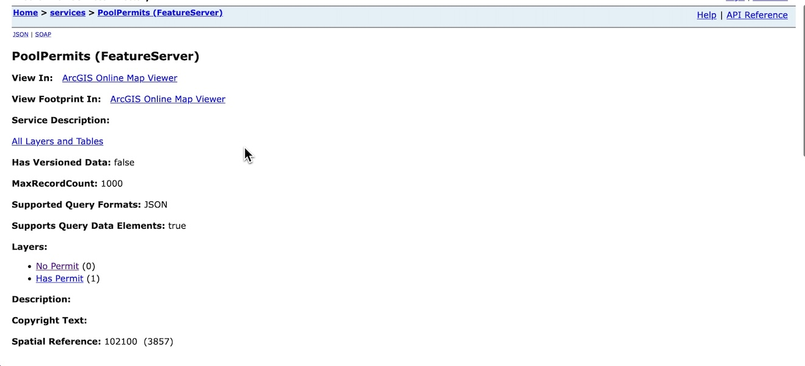
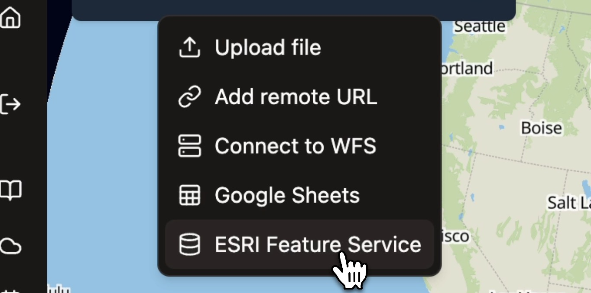
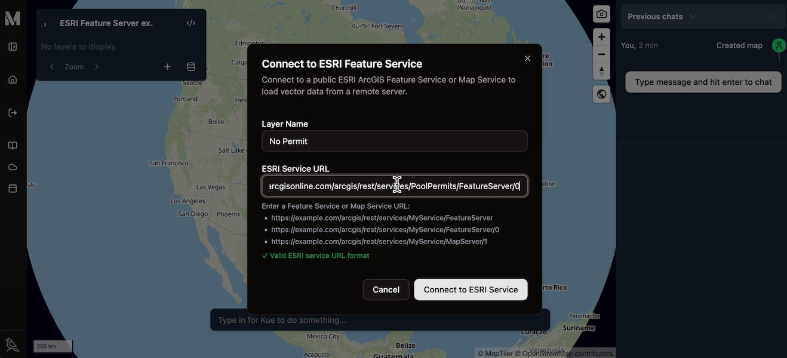
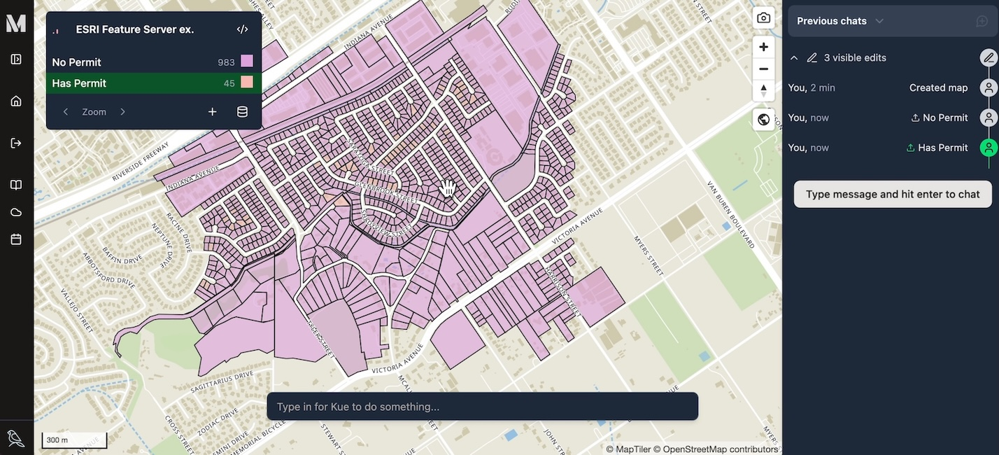

Mundi can directly connect to and display vector data from public ESRI ArcGIS
Feature Servers. This allows you to integrate data from
ArcGIS Online or an organization's ArcGIS Server directly into your Mundi maps
without needing to download files.

<iframe width="560" height="315" style="height: 316px; margin-left: auto; margin-right: auto;" src="https://www.youtube.com/embed/j02BYRS6-qE?si=MXy5zuVJj1u4WG7X" title="YouTube video player" frameborder="0" allow="accelerometer; autoplay; clipboard-write; encrypted-media; gyroscope; picture-in-picture; web-share" referrerpolicy="strict-origin-when-cross-origin" allowfullscreen></iframe>

This will create tiles from the features that allow for fast rendering of
large amounts of vector data.

## Adding a layer from a Feature Server

In this example, we're using a [Pool Permits](https://sampleserver6.arcgisonline.com/arcgis/rest/services/PoolPermits/FeatureServer) Feature Server that serves two layers:

1. No Permit (`0`)
2. Has Permit (`1`)

In Mundi, we add particular layers from a Feature Server, as opposed to adding
the entire server and all of its layers. Navigate to the server's REST endpoint in your browser.
You will typically see a list of layers.

Here, we'll want to add both layers `0` and `1`.
Click on the specific layer you wish to add to find its
unique URL. The correct URL will usually end with a number, like `/FeatureServer/0`.

### Enter layer URL into Mundi

Once you have the URL for the layer, you can add it in Mundi.

1.  From an open map, click the **Add layer source** (+) icon in the Map Layers
    panel.
2.  Select **ESRI Feature Service** from the dropdown menu.

A dialog box will appear, prompting you for the layer's details.

1.  **Layer Name**: Enter a descriptive name for the layer. This is how it will
    be identified in your layer list.
2.  **ESRI Server URL**: Paste the full URL of the specific layer you copied
    earlier. (includes `/0` or `/1`)
3.  Click the **Connect to ESRI Service** button.

Mundi will connect to the server and load the features for that layer onto
your map.

You can add multiple layers from the same Feature Server by simply repeating
the process for each layer's unique URL. For example, you can add the layer
at endpoint `.../FeatureServer/0` and then add the layer at
`.../FeatureServer/1` as a separate layer in your Mundi map.

Once loaded, these layers function like any other vector layer in Mundi. You
can inspect their attributes by clicking on features, change their styling,
and use them in analysis.

