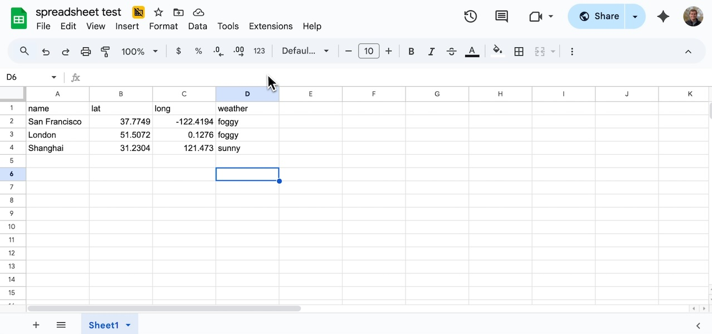
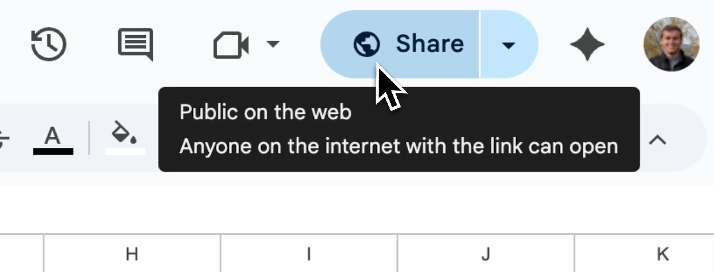
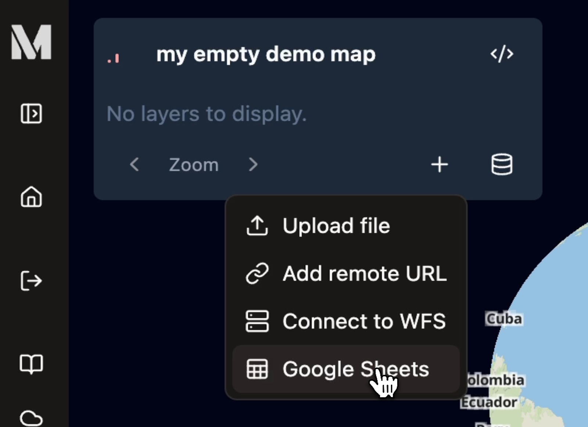
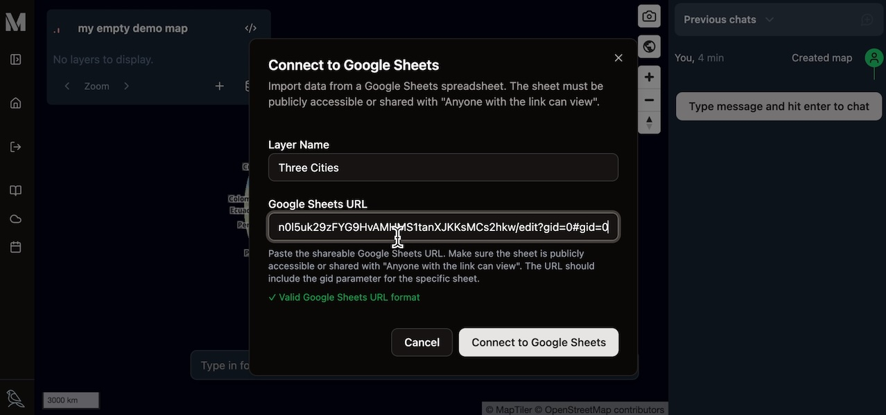
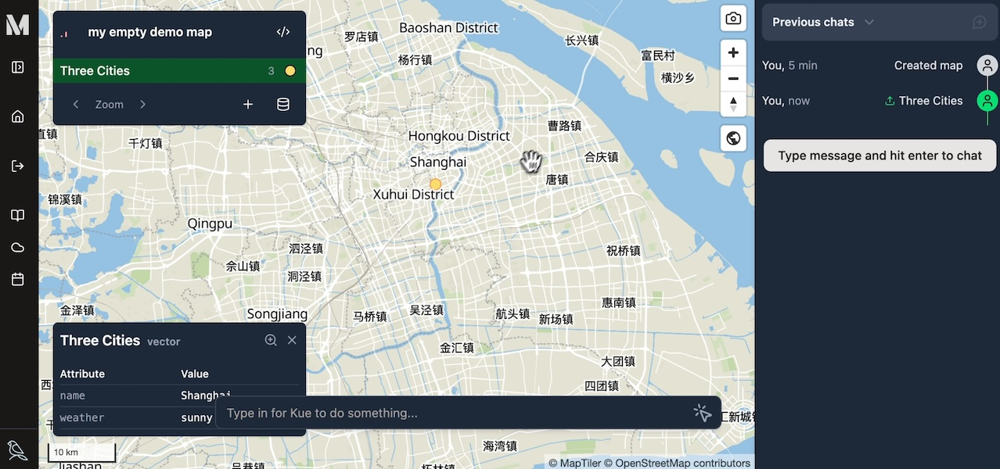

Mundi can directly connect to a link-accessible Google Sheet as a live data source.
This is the most accessible way to manage point spatial data in a collaborative way
for your team members. Using Google Sheets is
[advantageous to uploading CSVs](/getting-started/uploading-files/#spreadsheets-csv)
because it updates over time and keeps the data as a single source of truth.

<iframe width="560" height="315" style="height: 316px; margin-left: auto; margin-right: auto;" src="https://www.youtube.com/embed/qSXG2jv4Oz4?si=wh2BRQNpRz0iXXZV" title="YouTube video player" frameborder="0" allow="accelerometer; autoplay; clipboard-write; encrypted-media; gyroscope; picture-in-picture; web-share" referrerpolicy="strict-origin-when-cross-origin" allowfullscreen></iframe>

## Preparing your Google Sheet

Mundi automatically detects coordinate columns to create point geometries.
Your sheet must contain separate columns for latitude and longitude.

Mundi recognizes common header names such as:
-   `lat`, `latitude`
-   `lon`, `long`, `longitude`

Any additional columns in your sheet, like the `weather` column in this example,
will be imported as feature attributes, which you can use for styling and
analysis.

### Link-accessible view access

For Mundi to access the data, the Google Sheet **must be publicly accessible**.

In Google Sheets, click the **Share** button and set the General access to
**Anyone with the link** and the role to **Viewer**. Mundi only needs read
access to the sheet data.

## Adding the sheet to Mundi

Once your sheet is prepared and publicly shared, you can add it to your map.

1.  Copy the shareable URL from your Google Sheet's address bar. Make sure this
    URL includes the specific sheet identifier (e.g., `gid=0`).

2.  In Mundi, navigate to the **Map Layers** panel and click the **Add layer
    source** icon (the plus symbol).

3.  Select **Google Sheets** from the dropdown menu.

4.  In the **Connect to Google Sheets** modal, provide a **Layer Name** for
    your new layer and paste the URL of your Google Sheet into the **Google
    Sheets URL** field.

5.  Click **Connect to Google Sheets**. Mundi will fetch the data, parse the
    latitude and longitude columns to create point features, and add the new
    layer to your map.

### 3. Verifying the Data

After connecting, you will see the new points rendered on your map. The layer
will also appear in the **Map Layers** panel.

You can inspect the attributes of any feature to confirm that all your data was
imported correctly. Zoom in and click on a point to view its attributes. As you
can see, the `weather` column from our spreadsheet is now an attribute of the
feature.

Your Google Sheets data is now a fully functional vector layer in Mundi. You can
style it, use it in geoprocessing tools, or query it with Kue, Mundi's AI
assistant.