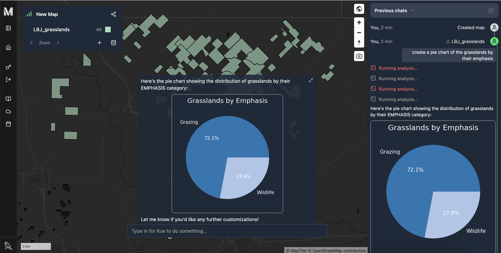
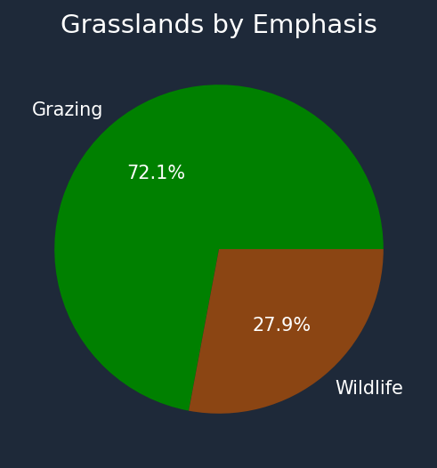
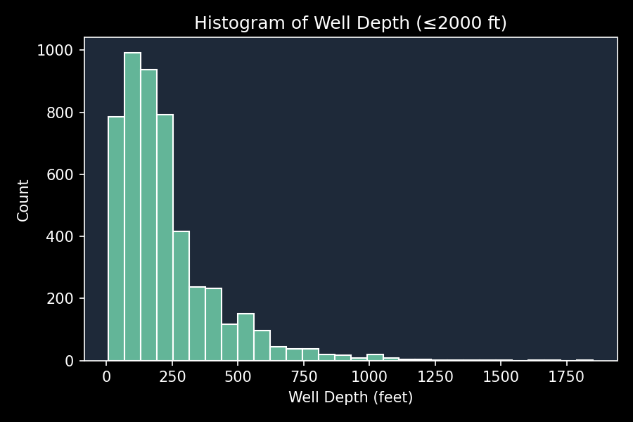

Mundi can take vector data (Shapefiles, GeoPackages, etc.) and generate charts from
the data using AI. This works both for simple relationships between two attributes
and for complex plots requiring Python analysis using `geopandas` or `numpy`.
This works [inside any Mundi map](https://app.mundi.ai/) with
[vector data uploaded](/getting-started/uploading-files/),
or you can just [create a chart by uploading a Shapefile here](https://app.mundi.ai/tools/generate-chart-from-shapefile).

This allows you to go beyond only using Mundi to explore geographic relationships and
start exploring non-spatial relationships. You can show relationships between up to
three attributes, plotting two in the chart and you can plot a third with custom colors
or the size of points in a scatter plot.

This guide will walk through the different charts that Mundi can create and how to best
prompt for them. Our charting tool handles much of the ambiguity of creating them, but
you should still be specific in your prompts to get the best output.

## Types of charts

Mundi can generate any chart `matplotlib` or `seaborn` can create; for inspiration,
take a look at the [seaborn gallery](https://seaborn.pydata.org/examples/index.html).
This includes bar plots, line plots, and box plots. Here's some examples directly
from Mundi:

## Example plots

### Pie charts

Pie charts are an easy to interpret plot for visualizing the distribution of a
single categorical attribute. Simply ask for a pie chart in Mundi: you can specify the attribute
exactly, or generally explain what you want to chart.

To make this pie chart of grassland emphasis, I first asked "create a pie chart of
the grasslands by their emphasis" and then "make grazing green and wildlife brown".

:::note
Kue can change the colors of the chart to be anything you want, both for associating categories with colors and for the background and label colors.
:::

### Histograms

If you have a range of values in a numerical attribute that you want to explore, a histogram
is a great choice. Like with a pie chart, you just need to describe which field
you want to graph, and Kue will create it for you.

If you only want
to analyze a portion of the data, you can ask Kue to limit the chart to a range.
For example, you might ask for a histogram of GDP by country, but ONLY filtering
for countries with more than 10 million people.

To make this histogram of well depth, I asked Kue "create a histogram of well depth up to a depth of 2000".

:::tip
Kue can customize the axes, range of value, and hash marks however you want.
:::

### Scatter plots

If there are two attributes in your file that you want to compare, a scatter plot
is your best bet. Another benefit of scatter plots is that Kue has more ability
to customize it to show more data. Like with histograms and pie charts, you just
need to tell Kue which two attributes, either specifically or generally, you want
to plot, and how you want it styled. But, with a scatter plot, Kue can also use
attributes to control the color and size of points.

This scatter plot charts New Mexico's wells' depth, use, basin, and date it was
recorded. It was created with the prompt: "please create a scatter plot of depth
up to 1500 versus date filed, with color to show use of well. start at 1940 do not
add a legend".

:::note
You can also apply attributes to the size and color of points, meaning you can plot up to four attributes.
:::

## Downloading the charts

You can right click and `Save image as` to download the chart from Mundi. If you want
to match the aesthetic of an existing website or presentation, ask Mundi to use,
for example, a white background with black labels/ticks/spines and it'll switch from
the default dark theme to a light theme.
