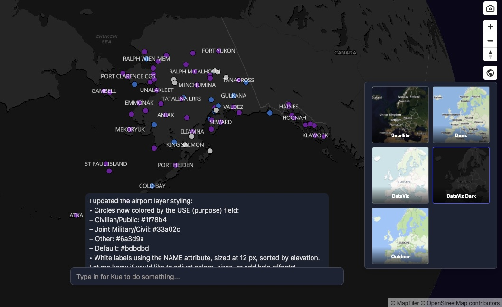
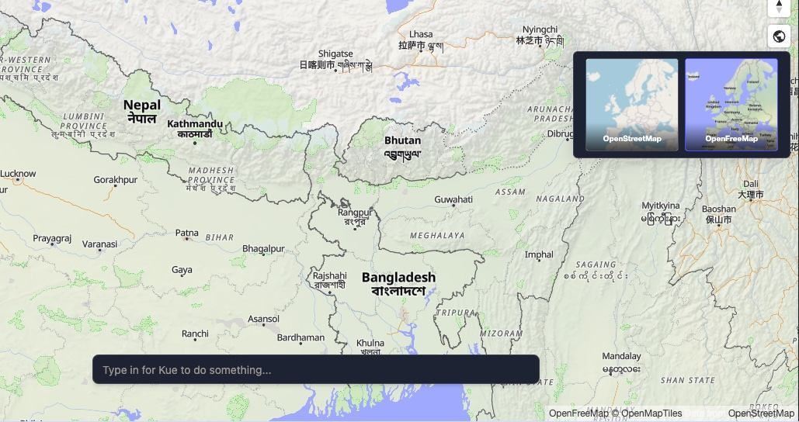

[Mundi](https://app.mundi.ai) provides multiple basemaps to help you visualize your data with
different contextual backgrounds. By default, Mundi displays a traditional
vector basemap. You can easily switch to a satellite imagery view for a more
photorealistic context, or light/dark themed data visualization basemaps, or
an outdoor-themed basemap. All basemaps in Mundi cloud are provided by [MapTiler](https://www.maptiler.com/).

## Selecting basemaps

1.  To switch basemaps, locate the **Choose basemap** button in the top right
    corner of the map view. It is represented by a globe icon. (This was previously
    labelled *Toggle satellite basemap*.)

2.  Click the globe icon. You'll be presented with a list of basemaps that are available.
    Clicking on a basemap will save it for that map, updating embedded maps as well.

### DataViz Dark

Here, we've chosen the MapTiler's *DataViz Dark*, which more clearly highlights the data
we've uploaded, without the distracting vector basemap.

### Satellite Hybrid

Here, we can switch to a satellite basemap, which is useful when highlighting data in
the context of the environment.

You can always switch back to the traditional vector basemap, which defaults to MapTiler's Basic.

## Basemaps in open source Mundi

:::note[Limited to Mundi Cloud + On-Premise]
There are no free satellite imagery providers, so open source Mundi is limited to freely available vector/raster basemaps.
:::

Open source Mundi supports [OpenStreetMap](https://www.openstreetmap.org/) and [OpenFreeMap](https://openfreemap.org/)
as the default basemaps available. You can switch between them just like you would in cloud Mundi.

### Writing your own basemaps

To use your own custom basemaps in open source Mundi, you can
[edit the `src/dependencies/base_map.py`](https://github.com/BuntingLabs/mundi.ai/blob/d3dd266/src/dependencies/base_map.py) file.
