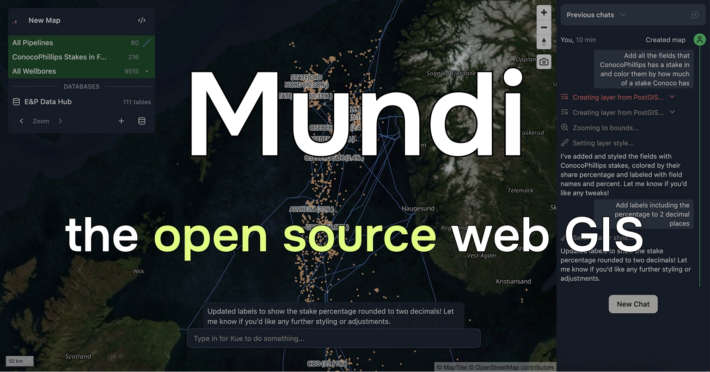

[Mundi](https://mundi.ai) is an open source web GIS built around AI.

- Supports vector, raster, and point cloud data
- Connects to and queries spatial databases like PostGIS
- Uses LLMs to call geoprocessing algorithms and edit symbology

You can try it for free on [Mundi cloud at `app.mundi.ai`](https://app.mundi.ai),
our hosted cloud service. [Mundi](https://github.com/BuntingLabs/mundi.ai)
is also self-hostable and open source under the AGPLv3 license, with full support for [local LLMs](/deployments/connecting-to-local-llm-with-ollama/).

import { Card, CardGrid, LinkCard } from '@astrojs/starlight/components';

## Starting on Mundi cloud

You can sign up for free at [app.mundi.ai](https://app.mundi.ai) to try out Mundi and read some guides to learn what's possible:

<LinkCard
  title="Making your first map"
  href="/getting-started/making-your-first-map"
  description="Learn how to create your first map in Mundi with sample data and basic visualization."
/>

<LinkCard
  title="Connecting to PostGIS"
  href="/guides/connecting-to-postgis"
  description="Mundi can connect to, add layers from, and query external PostGIS databases."
/>

# Using the Mundi developer API

You can use the [Mundi API](/developer-api/) to create maps, upload spatial data, render maps, and more.

## Self-hosting Mundi

Mundi is open source (AGPLv3) and can run entirely on your local machine with local LLMs.

We have a [tutorial on self-hosting Mundi](/deployments/self-hosting-mundi). Self-hosting requires
a good computer/server, git, and Docker. You can optionally connect it to a local LLM (or any
provider that supports the chat completions API).

Give us a [star on GitHub](https://github.com/BuntingLabs/mundi.ai),
[join our Discord to talk to us](https://discord.gg/V63VbgH8dT), or
[create a pull request](https://github.com/BuntingLabs/mundi.ai/pulls) to contribute back!
