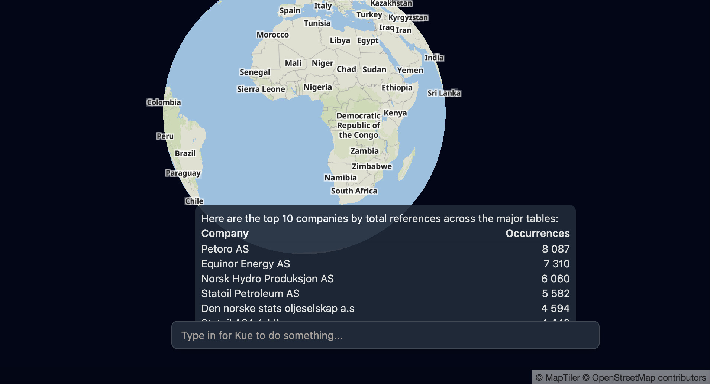
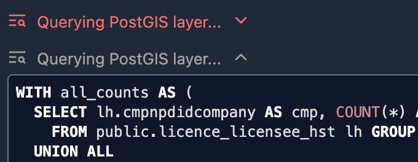
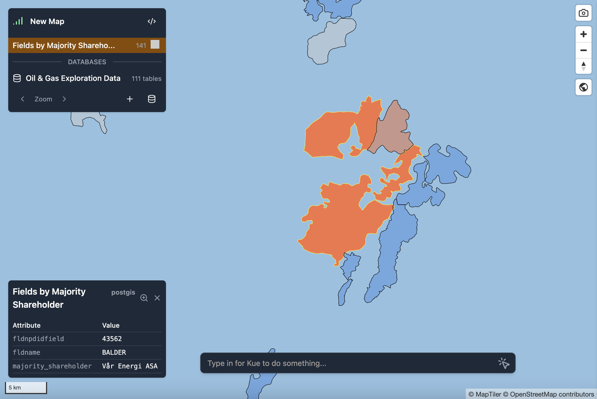
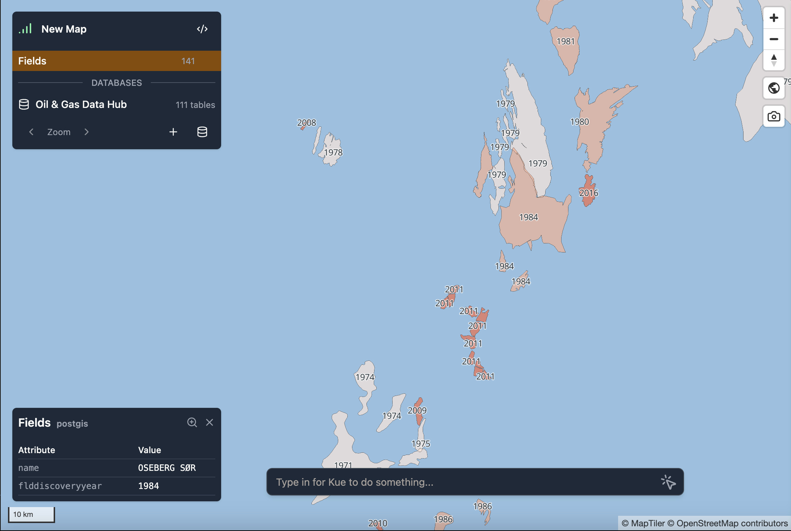
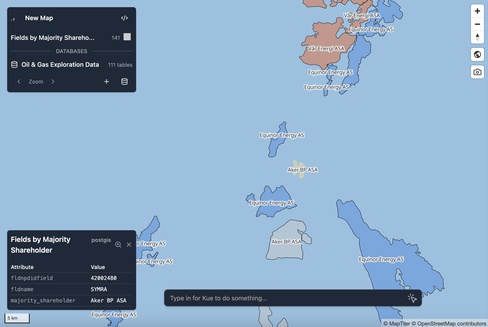
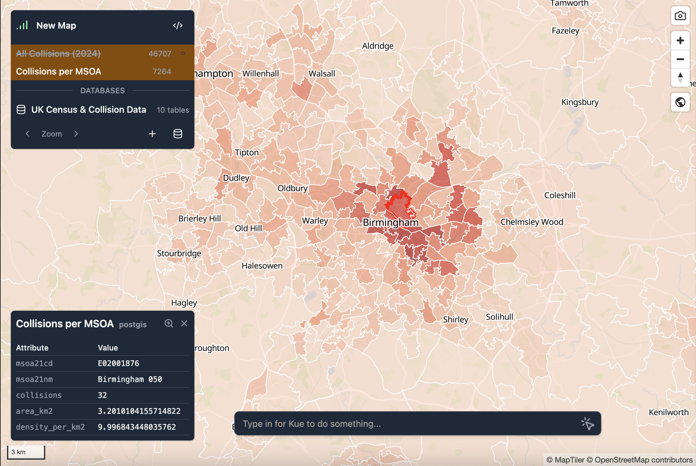

Mundi is a fast interface to explore the contents of any complex spatial database. You can add
its data to a map, style it with data-driven symbology, and run ad-hoc SQL queries against it.

Because Mundi is primarily driven using LLMs, beginners to spatial databases can query data with no
SQL familiarity, while experts can write complex queries faster and spot-check queries for correctness.

## Start with our demo PostGIS database

Mundi comes with a pre-built connection to an example PostGIS database you can explore before
[connecting to your own PostGIS](/spatial-databases/connecting-to-postgis/). Here is how to connect to it and a few prompts to run to get the full experience.

### Connecting to the database

Once you've [created your first map](/getting-started/making-your-first-map/), you can find the demo database inside the database connection menu.

1.  Click the **Load PostGIS** icon to get started.


2.  The **Add a PostGIS Database** menu will open.

3.  Click the **Demo Database** button, then **Add Connection** in the lower right to connect to the database.


4. Our demo has about 100 tables. The connection will take about 2 minutes to load. If it takes longer than 2 minutes, refresh the page.

:::note[Open Data License]
The database is from the [Norwegian Offshore Directorate](https://www.sodir.no/en/) and is licensed under the [Norwegian Licence for Open Government Data](https://data.norge.no/nlod/en).
:::

### Example requests to Kue

To get a better sense of what Kue can do, try asking:
- **what companies control the most pipelines?**
- **add all of the pipelines and style by in service status with labels**
- **add all of ConocoPhillips fields**

## AI database documentation

You can hover over the database name and click on it to view the generated wiki page.


The wiki page is generated by an AI model that sees your database schema, example data, foreign key
relationships, etc. It includes diagrams explaining how different tables relate to each other:


## Asking questions about the database

Between looking at the documentation and adding new layers, you can ask questions about the database. This could be as narrow as "tell me the attributes for this feature" or as broad as "list all of the companies mentioned in the database."

:::tip[Request to Kue]
what are the top 10 companies that appear most among all the tables?
:::



**Kue's SQL from this request**
```sql
WITH all_counts AS (
  SELECT lh.cmpnpdidcompany AS cmp, COUNT(*) AS cnt
    FROM public.licence_licensee_hst lh GROUP BY lh.cmpnpdidcompany
  UNION ALL
  -- ... shortened for brevity ...
  -- ... 20+ lines of SQL ...
  SELECT wb.cmpnpdidcompany AS cmp, COUNT(*)
    FROM public.wellbore wb GROUP BY wb.cmpnpdidcompany
)
SELECT c.cmplongname AS company, SUM(ac.cnt) AS occurrences
FROM all_counts ac
JOIN public.company c ON c.cmpnpdidcompany = ac.cmp
GROUP BY c.cmplongname
ORDER BY occurrences DESC
LIMIT 10;
```

### Reviewing Kue's SQL

You can open the dropdowns in the chat on the right to review Kue's SQL and learn more about what it is trying to do. If the dropdown is red then it means the action failed.
Failed actions are common, and not indicative of a problem.



## Selecting features

Left clicking on a feature highlights its attributes in the bottom left portion of the map. In this example, I've highlighted an oil field to see who owns it.



:::note[Kue can see your selected features]
Kue knows when you select a feature and can see that feature's attributes / primary ID. **Kue can**: change only that feature's symbology, search for nearby features, or query tables relating to that feature.
:::

## Creating layers from PostGIS queries

Once connected, you can ask Kue, the AI assistant in Mundi, to create new map layers that source
spatial data from the connected PostGIS database.

:::tip[Request to Kue]
can you add a layer for the wellbores from my postgis database?
:::


This creates a dynamic layer in Mundi that continuously pulls data from your PostGIS database:


## Using symbology to analyze data

Kue is capable of adjusting a layer's symbology to make it easier to interpret the data. This is possible with the size of layers, conditional symbology, graduated symbology, and with labels.

You can both specifically ask Kue to change symbology in a certain way (for example, turn the polygon layer blue or label the points with their name) and ask it to generally style a layer (for example, style the pipeline by its diameter).

### Prompting tips

Mundi uses the strongest AI models available, so there is no need for any special prompting. You can either enter general requests which Kue will then try to best satisfy or be as specific as you would like, which it will also handle.

For general requests, Kue will do what it thinks best fits your goal. For example, if you ask Kue to "style the parks based on how many visitors they get in a year", it might decide to label the parks with visitor count and give a color gradient where light is fewer visitors and dark is more.

You can also be as specific as you would like with any part of your prompt. Using the previous example, if you want Kue to label the parks with their name and to use a green color gradient where dark green is fewer visitors and light green is more, you just have to mention that.

### Graduated symbology

One of the most powerful ways that Kue can easily make analysis understandable is through graduated symbology. This can be done to show, for example, a progression through time, a concentration, or any other gradient.

:::tip[Request to Kue]
apply a graduated style to the fields based on the year they were discovered and label each field with the year
:::



### Conditional symbology

If you want to show different groups of data you can use conditional symbology. If you ask Kue to style based on an attribute that is not a scale but instead are discrete, it will create conditional symbology based on the attributes. So attribute A will be red, attribute B will be blue, and so on.

:::tip[Request to Kue]
style each field based on its majority shareholder and label them with the majority shareholder
:::



## Adding labels to data

You can label a layer based on any attribute.

:::tip[Request to Kue]
label the pipelines based on their in service status
:::


## Combining analysis requests with symbology
If you have multiple layers from your spatial database and want to see how they interact, Kue can run complex SQL to combine them, find a new insight, and make the insight visual via symbology.

:::tip[Request to Kue]
please merge the collisions and super output area as a polygon and style it by how many collisions they have relative to their area
:::



**Kue's SQL**
```sql
SELECT
  m.fid AS id,
  m.msoa21cd,
  m.msoa21nm,
  COUNT(c.collision_index) AS collisions,
  ST_Area(m.shape)/1000000.0 AS area_km2,
  COUNT(c.collision_index) / (ST_Area(m.shape)/1000000.0) AS density_per_km2,
  m.shape AS geom
FROM census2021.msoa_2021_ew_bgc_v3 AS m
LEFT JOIN stats19.dft_collision_2024 AS c
  ON ST_Within(c.geom, m.shape)
GROUP BY m.fid, m.msoa21cd, m.msoa21nm, m.shape